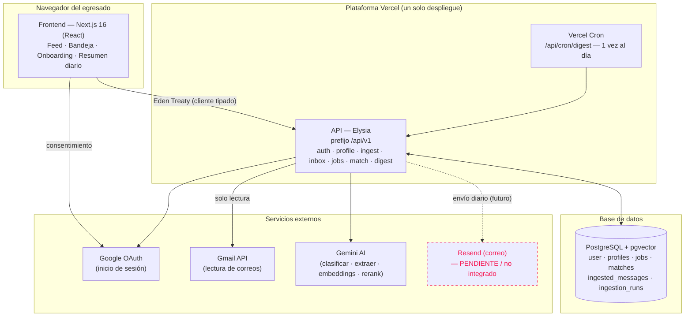
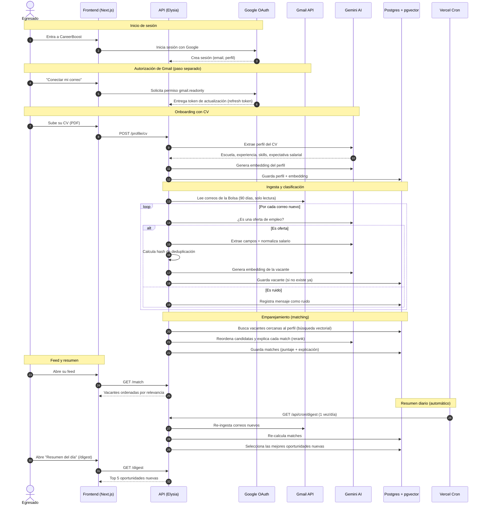
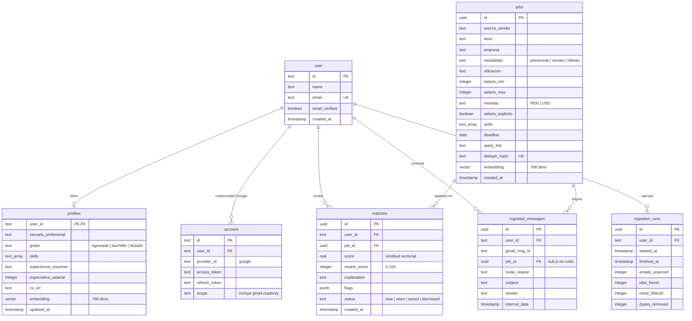

# Documentación Técnica — CareerBoost

> Bolsa de trabajo inteligente para egresados de la Universidad Nacional de San Agustín (UNSA).
> Desafío **CONECTA UNSA** — Hackatón Nacional Transformagob 2026.
>
> Este documento está dirigido a dos públicos: el **jurado** (no necesita perfil técnico) y el **equipo de TI de la UNSA** (necesita detalle de implementación). Los términos técnicos se explican brevemente la primera vez que aparecen. Cada sección puede leerse de forma independiente.

---

## 1. Resumen ejecutivo

La Bolsa de Trabajo de la UNSA atiende a **9,179 usuarios** (3,498 egresados, 3,240 bachilleres, 2,441 titulados) como un canal de difusión masiva: cada usuario recibe **más de 100 correos al mes** sin segmentar. En el semestre 2025-2 se enviaron 736 correos, de los cuales **27% era ruido** (no eran ofertas de empleo) y **90% de las vacantes no indicaban remuneración**. El resultado es saturación, desconfianza y fuga de egresados hacia plataformas externas como Computrabajo o LinkedIn.

**CareerBoost** resuelve el problema desde el lado del egresado, sin esperar a que la institución reemplace su sistema de correos. El egresado conecta su cuenta de Google en modo **solo lectura** (la aplicación nunca escribe ni envía correos), sube su CV una vez, y el sistema:

1. Lee los correos de la Bolsa de Trabajo y descarta los que no son ofertas reales.
2. Convierte cada vacante en una ficha estandarizada (puesto, empresa, modalidad, lugar, sueldo, requisitos, enlace).
3. Compara cada vacante con el perfil profesional del egresado y le muestra solo las que coinciden, con un puntaje y una explicación de "por qué te lo recomendamos".
4. Genera un **resumen diario** con las mejores oportunidades.

**A quién sirve:** egresados de la UNSA que buscan empleo activamente (alcance del prototipo), con un diseño escalable a los 9,179 usuarios de la Bolsa de Trabajo y replicable en otras universidades públicas.

**Resultado esperado:** reducir el ruido del canal institucional, dar visibilidad a la información salarial, y devolver la confianza en la Bolsa de Trabajo como puente entre la Universidad y el mercado laboral. Alineado con los Objetivos de Desarrollo Sostenible **4** (educación de calidad) y **8** (trabajo decente).

---

## 2. Alcance del proyecto

### 2.1. Qué SÍ hace el MVP

El MVP (*Minimum Viable Product*, producto mínimo viable: la versión más pequeña que ya entrega valor) cubre, de extremo a extremo:

- **Inicio de sesión** con cuenta de Google.
- **Conexión de Gmail en modo solo lectura**, como un paso de autorización separado y explícito.
- **Onboarding con CV**: el egresado sube su CV en PDF y el sistema extrae automáticamente su escuela profesional, experiencia, habilidades y expectativa salarial.
- **Ingesta de correos**: lee los correos de los remitentes oficiales de la Bolsa de Trabajo en una ventana de los últimos 90 días.
- **Clasificación**: separa las ofertas de empleo reales del ruido (avisos, trámites, comunicados).
- **Extracción y estandarización**: convierte cada oferta en una ficha con campos uniformes.
- **Normalización de salario**: detecta el rango salarial y marca explícitamente cuándo una vacante no informa sueldo.
- **Deduplicación**: evita que la misma vacante reenviada varias veces aparezca repetida.
- **Emparejamiento (matching) semántico**: compara el perfil con cada vacante y produce un puntaje y una explicación.
- **Feed personalizado**: lista de vacantes ordenadas por relevancia.
- **Bandeja de guardados**: el egresado marca y conserva vacantes de interés.
- **Resumen diario** de las mejores oportunidades nuevas, dentro de la aplicación.

### 2.2. Qué NO hace (fuera de alcance)

Para evitar expectativas falsas, el MVP **no** incluye:

- Envío del resumen por correo electrónico (ver nota en la sección 7). El resumen diario se consulta dentro de la aplicación; la entrega por correo quedó **pendiente**.
- Integración directa con los sistemas internos de la UNSA (la fuente de datos hoy es el Gmail personal del egresado).
- Scraping o conexión con bolsas externas (Computrabajo, LinkedIn, etc.).
- Canales adicionales (WhatsApp, notificaciones push, SMS).
- Panel administrativo para el personal de la Bolsa de Trabajo.
- Auto-postulación o envío automático de CVs.
- Deduplicación global entre distintos usuarios más allá de la ficha de vacante compartida.
- Ajuste fino (*fine-tuning*) de modelos de inteligencia artificial.
- Cobertura formal de bachilleres y titulados (el modelo de datos ya lo soporta; el MVP se enfoca en egresados).

### 2.3. Restricciones técnicas y normativas

- **Protección de datos personales (Ley N.º 29733 — Perú):** el acceso a Gmail es de **solo lectura** y requiere consentimiento explícito del usuario. El egresado puede desconectar su cuenta y borrar sus datos en cualquier momento (el borrado del usuario elimina en cascada su perfil, sus emparejamientos y su registro de mensajes procesados).
- **Minimización de datos:** de los correos que no son ofertas, solo se guarda el identificador del mensaje, asunto y remitente (no el contenido). No se almacenan correos personales completos.
- **Compatibilidad con sistemas UNSA:** el MVP **no** requiere ninguna integración con la infraestructura de la Universidad; funciona del lado del egresado. La segunda etapa contempla recibir las convocatorias directamente desde la Bolsa de Trabajo para no depender del correo personal.
- **Software Público peruano:** el proyecto usa exclusivamente tecnologías de código abierto o servicios con alternativas abiertas, sin software propietario restrictivo, de modo que pueda liberarse como Software Público y replicarse en otras universidades. Las dependencias externas de pago (modelo de IA, base de datos gestionada) son sustituibles por equivalentes auto-hospedados.

---

## 3. Arquitectura del sistema

CareerBoost es **una sola aplicación** Next.js desplegada como un único proceso. Dentro de esa aplicación corre la API (*Application Programming Interface*, la capa que atiende las peticiones de datos) construida con Elysia y montada como manejador de rutas. No hay microservicios ni varios despliegues: un solo servidor, un solo despliegue.



**Cómo se leen los flujos:**

- El **frontend** (la parte visible en el navegador) habla con la **API** mediante un cliente tipado (*Eden Treaty*), que garantiza que las llamadas y las respuestas coincidan en tipos.
- La **API** es la única que toca la **base de datos**, los **modelos de IA** y **Gmail**. El frontend nunca llama directamente a servicios externos.
- **Vercel Cron** es un temporizador en la nube que invoca la API una vez al día para preparar el resumen.
- El acceso a **Gmail** es siempre **solo lectura**.
- **Resend** (servicio de envío de correo) aparece con línea punteada: estaba previsto para enviar el resumen por correo, pero **no está integrado en el MVP**; el envío quedó como trabajo futuro.

---

## 4. Flujo del usuario

Este diagrama muestra el camino completo de un egresado, desde que inicia sesión hasta que recibe su resumen diario.



---

## 5. Modelo de datos

El sistema usa **PostgreSQL** (base de datos relacional) con la extensión **pgvector**, que permite guardar *embeddings* (representaciones numéricas del significado de un texto) y buscar por similitud. Drizzle es la herramienta que define el esquema en código.

Tablas principales:

- **user / account** — identidad y tokens de Google (gestionadas por la librería de autenticación).
- **profiles** — perfil profesional del egresado, extraído del CV.
- **jobs** — bolsa global de vacantes ya estandarizadas (compartida entre usuarios).
- **matches** — emparejamientos entre un usuario y una vacante.
- **ingested_messages** — registro por usuario de qué correos ya se procesaron.
- **ingestion_runs** — bitácora de cada corrida de ingesta (métricas).



**Notas de diseño:**

- `jobs` es un **pool global**: una vacante reenviada a varios egresados se guarda una sola vez (restricción única sobre `dedupe_hash`). Las tablas `profiles`, `matches`, `ingested_messages` e `ingestion_runs` son **por usuario**.
- La pareja `(user_id, gmail_msg_id)` es única: un correo no se procesa dos veces para el mismo usuario.
- La pareja `(user_id, job_id)` es única en `matches`: un usuario no tiene matches duplicados de la misma vacante.
- El borrado de un usuario elimina en cascada sus datos derivados (`onDelete: cascade`).

---

## 6. Features clave

> Estados: **implementado** (funciona de extremo a extremo en el MVP) · **parcial** (núcleo funcional, falta una pieza) · **pendiente** (diseñado, no construido).

### Login con Google
- **Qué hace:** permite al egresado entrar con su cuenta institucional o personal de Google.
- **Cómo funciona:** usa Better Auth con el proveedor Google (protocolo OAuth 2.0). El inicio de sesión solo pide datos básicos (`email`, `profile`). La sesión y los tokens se guardan en las tablas `session` y `account`.
- **Estado:** implementado.

### Conexión de Gmail (solo lectura)
- **Qué hace:** autoriza a CareerBoost a leer (nunca escribir) los correos del egresado.
- **Cómo funciona:** es un segundo paso de consentimiento, separado del login, que solicita el permiso `gmail.readonly`. Se configura el proveedor con `accessType: offline` para obtener un *refresh token* (token de actualización que permite renovar el acceso sin volver a pedir consentimiento). El token se lee del servidor de forma fresca; nunca se registra en logs.
- **Estado:** implementado.

### Onboarding con CV
- **Qué hace:** construye el perfil profesional a partir del CV en PDF.
- **Cómo funciona:** `POST /profile/cv` recibe el archivo, lo guarda y envía su texto a Gemini con un esquema de salida estructurado (la IA responde en un formato fijo, no en texto libre). Se extraen escuela, experiencia, habilidades y expectativa salarial, y se genera un *embedding* del perfil para el emparejamiento.
- **Estado:** implementado. *Nota:* el almacenamiento del PDF es en disco local (modo desarrollo); producción debe usar un almacén de objetos.

### Ingesta y clasificación de correos
- **Qué hace:** lee los correos de la Bolsa de Trabajo y separa ofertas reales del ruido.
- **Cómo funciona:** consulta Gmail con el filtro `from:(remitentes) newer_than:90d` (hasta 200 mensajes). Por cada correo no procesado, Gemini decide si es una oferta de empleo; si lo es, se extrae y guarda; si no, se registra solo el identificador y el motivo del descarte. Cada corrida queda registrada en `ingestion_runs` con sus métricas. Remitente por defecto: `udeeg_convocatorias@unsa.edu.pe` (configurable).
- **Estado:** implementado.

### Normalización de salario
- **Qué hace:** detecta el rango salarial de cada vacante y marca con claridad cuándo no se informa.
- **Cómo funciona:** estrategia "IA primero, regla después". Gemini propone el bloque salarial; se confía en él solo si declara un monto numérico explícito; en caso contrario, una expresión regular (regex) determinista busca cifras. Frases como "según mercado" o "a tratar" se marcan como `salario_explicito = false`. Se normaliza moneda (PEN/USD) y periodo (mes/hora/año).
- **Estado:** implementado.

### Deduplicación
- **Qué hace:** evita vacantes repetidas cuando la Bolsa reenvía el mismo aviso.
- **Cómo funciona:** se calcula un hash SHA-256 sobre el título y la empresa normalizados (sin acentos, en minúsculas, sin espacios redundantes). Una restricción única sobre `dedupe_hash` garantiza una sola fila por vacante en el pool global.
- **Estado:** implementado.

### Embeddings y búsqueda vectorial
- **Qué hace:** encuentra las vacantes más parecidas al perfil sin depender de palabras exactas.
- **Cómo funciona:** tanto el perfil como cada vacante se convierten en un *embedding* de 768 dimensiones (modelo `gemini-embedding-2`). Se guardan en columnas `vector(768)` de pgvector con un índice HNSW por distancia coseno. La búsqueda recupera las 50 vacantes más cercanas al perfil.
- **Estado:** implementado.

### Rerank con Gemini
- **Qué hace:** reordena las candidatas y explica por qué cada una encaja.
- **Cómo funciona:** las 50 candidatas pasan por `gemini-2.5-flash`, que asigna a cada una un puntaje entero de 0 a 100 (`rerank_score`) y una explicación breve. Las que quedan por debajo de 50 se descartan del feed y del resumen. Esto convierte una similitud matemática en una recomendación justificada.
- **Estado:** implementado.

### Feed personalizado
- **Qué hace:** muestra al egresado solo las vacantes relevantes, ordenadas por relevancia.
- **Cómo funciona:** `GET /match` devuelve los emparejamientos del usuario por encima del umbral, ordenados por `rerank_score`, cada uno con su explicación y su distintivo (*badge*) de salario (verde = visible / gris = no informado).
- **Estado:** implementado.

### Bandeja de guardados
- **Qué hace:** permite conservar vacantes de interés para revisarlas después.
- **Cómo funciona:** `PATCH /match/:id` cambia el estado del emparejamiento (`new` → `saved` / `dismissed`). `GET /match/saved` lista las guardadas. El estado vive en la columna `status` de `matches`.
- **Estado:** implementado.

### Resumen diario
- **Qué hace:** entrega una vista compacta con las mejores oportunidades nuevas del día.
- **Cómo funciona:** Vercel Cron invoca `/api/cron/digest` una vez al día; por cada usuario elegible refresca el token, vuelve a ingerir y emparejar, y selecciona los 5 mejores matches nuevos por encima del umbral. El egresado lo consulta en `/digest`; `POST /digest/seen` marca los nuevos como vistos. **El envío por correo (Resend) fue removido del código**, por lo que el resumen hoy se consulta dentro de la aplicación.
- **Estado:** **parcial** (resumen en la aplicación: implementado · envío por correo: pendiente).

---

## 7. Stack tecnológico

> Las versiones reflejan los rangos declarados en `package.json` (el operador `^` admite actualizaciones menores compatibles).

| Capa | Tecnología | Versión | Propósito |
|---|---|---|---|
| Framework / Servidor | Next.js | ^16.0.0 | Aplicación única (frontend + alojamiento de la API) con App Router. |
| UI | React | ^19.0.0 | Construcción de la interfaz. |
| Estilos | Tailwind CSS | ^4.3.1 | Sistema de estilos por utilidades. |
| Componentes | Radix UI / shadcn | ^1.5.0 | Componentes accesibles de interfaz. |
| API | Elysia | ^1.4.28 | Servidor de la API, montado dentro de Next.js en `/api/v1`. |
| Cliente API | Eden Treaty (`@elysiajs/eden`) | ^1.4.9 | Llamadas tipadas del frontend a la API. |
| Datos en cliente | TanStack Query | ^5.101.0 | Caché y sincronización de datos en el navegador. |
| Autenticación | Better Auth | ^1.6.18 | Login con Google y manejo de sesión/tokens. |
| ORM | Drizzle ORM | ^0.45.2 | Definición del esquema y consultas tipadas a la base de datos. |
| Base de datos | PostgreSQL (driver `postgres`) | ^3.4.9 | Almacenamiento relacional. |
| Búsqueda vectorial | pgvector (extensión) | — | Columnas `vector(768)` e índice HNSW por similitud. |
| Inteligencia artificial | Google Gemini (`@google/genai`) | ^2.8.0 | Clasificación, extracción, embeddings y rerank. |
| Validación | Zod | ^4.4.3 | Esquemas y validación de datos. |
| Tareas programadas | Vercel Cron | — | Disparo diario del resumen. |
| Calidad de código | Biome | ^2.5.0 | Formateo y linting (sin ESLint). |
| Pruebas | Vitest | ^4.1.8 | Pruebas unitarias y de servicios. |
| Lenguaje | TypeScript | ^5.7.0 | Tipado estático en todo el proyecto. |

Modelos de IA usados: `gemini-2.5-flash` (clasificar / extraer / rerank) y `gemini-embedding-2` truncado a 768 dimensiones (embeddings).

---

## 8. Estructura de carpetas

```text
CareerBoost/
├── src/
│   ├── app/                      # Rutas de Next.js (páginas y API)
│   │   ├── (app)/                # Páginas autenticadas del egresado
│   │   │   ├── feed/             #   Feed de vacantes recomendadas
│   │   │   ├── bandeja/          #   Bandeja de entrada de convocatorias
│   │   │   ├── guardados/        #   Vacantes guardadas
│   │   │   ├── digest/           #   Resumen diario
│   │   │   ├── bolsa/            #   Estado de sincronización con la Bolsa
│   │   │   └── perfil/           #   Perfil profesional del egresado
│   │   ├── onboarding/           # Alta inicial (subida de CV)
│   │   ├── auth/                 # Pantallas de login
│   │   └── api/
│   │       ├── v1/[[...slugs]]/  # Punto de montaje de la API Elysia
│   │       └── cron/digest/      # Endpoint invocado por Vercel Cron
│   ├── server/                   # Todo el código de servidor
│   │   ├── router.ts             #   Ensambla la API y sus sub-routers
│   │   ├── routers/              #   Endpoints por dominio (me, gmail, profile, ingest, inbox, jobs, match, digest)
│   │   ├── services/             #   Lógica de negocio (ingesta, matching, salario, dedupe, gmail, digest...)
│   │   ├── ai/                   #   Prompts y llamadas a Gemini (clasificar, extraer, embed, rerank)
│   │   ├── auth/                 #   Configuración de Better Auth
│   │   └── drizzle/              #   Cliente de base de datos y esquemas de tablas
│   ├── frontend/                 # Código de interfaz reutilizable
│   │   ├── components/           #   Componentes (feed, onboarding, perfil, ui...)
│   │   ├── hooks/                #   Hooks de datos (API tipada)
│   │   ├── auth/                 #   Cliente de autenticación y helper de Gmail
│   │   └── lib/                  #   Utilidades (formato, cliente Eden, query client)
│   └── config/                   # Configuración cliente/servidor y validación de entorno
├── drizzle/                      # Migraciones generadas de la base de datos
├── scripts/                      # Utilidades (init, seed-demo, erase de la BD)
├── docs/                         # Documentación y entregables
└── package.json                 # Dependencias y scripts del proyecto
```

---

## 9. Endpoints principales de la API

Todas las rutas cuelgan del prefijo **`/api/v1`**. La autenticación se basa en la sesión de Better Auth (cookie de sesión); algunas rutas exigen además tener **Gmail conectado**.

| Método | Ruta | Descripción | Autenticación |
|---|---|---|---|
| GET | `/health` | Verificación de que el servicio está vivo. | No |
| `*` | `/auth/*` | Endpoints de Better Auth (login, callback de Google, sesión). | Según el flujo |
| GET | `/me` | Datos del usuario y si tiene Gmail conectado. | Sesión |
| GET | `/gmail/profile` | Comprueba que el token de Gmail funciona (devuelve el email). | Sesión + Gmail |
| POST | `/profile/cv` | Sube el CV y construye el perfil. | Sesión |
| GET | `/profile` | Devuelve el perfil del egresado. | Sesión |
| PUT | `/profile` | Actualiza campos del perfil. | Sesión |
| POST | `/ingest` | Lanza una ingesta de correos a demanda. | Sesión + Gmail |
| GET | `/ingest/last` | Métricas de la última corrida de ingesta. | Sesión |
| GET | `/inbox` | Lista de mensajes procesados (convocatorias y ruido). | Sesión |
| GET | `/inbox/live` | Vista en vivo de la bandeja desde Gmail. | Sesión + Gmail |
| GET | `/inbox/pending-count` | Número de correos sin procesar. | Sesión |
| GET | `/jobs` | Vacantes del pool global. | Sesión |
| POST | `/match` | Calcula los emparejamientos del usuario. | Sesión (requiere perfil) |
| GET | `/match` | Feed de vacantes recomendadas. | Sesión |
| GET | `/match/saved` | Vacantes guardadas. | Sesión |
| GET | `/match/:id` | Detalle de un emparejamiento. | Sesión |
| PATCH | `/match/:id` | Cambia el estado (guardar / descartar / visto). | Sesión |
| GET | `/digest` | Resumen diario (top 5 nuevas). | Sesión |
| POST | `/digest/seen` | Marca las oportunidades del resumen como vistas. | Sesión |
| GET | `/api/cron/digest` | Disparo del resumen (uso interno de Vercel Cron). | Secreto de cron |

---

## 10. Despliegue y entornos

**Plataforma.** La aplicación se despliega en **Vercel** como un único proyecto Next.js. La API Elysia viaja dentro del mismo despliegue (no hay servidor aparte). La base de datos es PostgreSQL con la extensión pgvector (en producción, un Postgres gestionado tipo Supabase o Neon).

**Demo pública:** `https://careerboost-weld.vercel.app`
**Repositorio:** `https://github.com/S-kkipie/careerboost`

**Variables de entorno requeridas:**

| Variable | Propósito |
|---|---|
| `DATABASE_URL` | Cadena de conexión a PostgreSQL (con pgvector). |
| `BETTER_AUTH_SECRET` | Secreto para firmar sesiones (mínimo 32 caracteres). |
| `NEXT_PUBLIC_APP_URL` | URL pública de la aplicación. |
| `GOOGLE_CLIENT_ID` | Identificador de cliente de Google OAuth. |
| `GOOGLE_CLIENT_SECRET` | Secreto de cliente de Google OAuth. |
| `GEMINI_API_KEY` | Clave del modelo de IA Gemini. |
| `CRON_SECRET` | Protege el endpoint del cron (mínimo 16 caracteres). |
| `BOLSA_SENDERS` | Lista de remitentes oficiales de la Bolsa (separados por coma). Vacío usa el valor por defecto. |
| `RESEND_API_KEY`, `RESEND_FROM` | Reservadas para el envío de correo (pendiente; el código de envío fue removido). |

**Tareas programadas (cron jobs) activas:**

| Ruta | Programación | Acción |
|---|---|---|
| `/api/cron/digest` | `0 13 * * *` (13:00 UTC ≈ 08:00 hora Perú, diario) | Re-ingesta correos, recalcula emparejamientos y prepara el resumen del día por usuario. |

**Puesta en marcha local (resumen):** `pnpm install` → copiar `.env.example` a `.env.local` y completar → `pnpm db:push` (crea el esquema y la extensión pgvector) → `pnpm dev` (http://localhost:3000).

---

## 11. Seguridad y privacidad

- **Permiso mínimo de Gmail.** CareerBoost solo solicita `gmail.readonly`. No pide ni acepta permisos de escritura, envío o borrado. No puede modificar la bandeja del egresado.
- **Consentimiento en dos pasos.** El login (datos básicos) y la conexión de Gmail son acciones separadas y explícitas. El egresado decide conectar su correo, y puede desconectarlo.
- **Manejo de tokens.** Los tokens de Google se guardan en la tabla `account`. El servidor obtiene un token de acceso fresco en cada operación (renovándolo con el *refresh token*) y nunca lo lee directamente desde una respuesta al navegador. **Nunca** se escriben tokens ni contenidos de correo en los logs.
- **Aislamiento por usuario.** No se usa seguridad a nivel de fila de la base de datos; en su lugar, **cada consulta se filtra explícitamente por `user_id`**. Un usuario no puede ver perfiles, emparejamientos ni mensajes de otro. Las restricciones únicas `(user_id, gmail_msg_id)` y `(user_id, job_id)` refuerzan ese aislamiento.
- **Minimización de datos.** De los correos que no son ofertas solo se conserva el identificador, asunto y remitente, no el contenido. El borrado de un usuario elimina en cascada todos sus datos derivados.
- **Cumplimiento de la Ley N.º 29733 (Protección de Datos Personales — Perú).** El tratamiento se sostiene en el consentimiento informado del titular, con finalidad acotada (recomendación de empleo), permiso mínimo, y derecho de desconexión y supresión. Punto de mejora identificado: la tabla `jobs` guarda el texto crudo de la convocatoria (`raw_email`) para fines de extracción y auditoría; para un despliegue institucional se recomienda definir una política de retención y depuración de ese campo.

---

## 12. Roadmap post-hackatón

Hitos en orden de prioridad para llevar el MVP a un servicio institucional:

1. **Completar el envío del resumen por correo.** Reintegrar la entrega del resumen diario (Resend u otro proveedor con alternativa abierta) para que el egresado lo reciba sin abrir la aplicación.
2. **Almacenamiento de CVs en producción.** Reemplazar el disco local por un almacén de objetos (blob store) con control de acceso.
3. **Validación con usuarios reales.** Pilotear con egresados de distintas escuelas profesionales y con el personal de la Bolsa de Trabajo; medir reducción de ruido y calidad de las recomendaciones.
4. **Integración directa con la Bolsa de Trabajo UNSA.** Recibir las convocatorias desde el sistema institucional, para dejar de depender del Gmail personal del egresado.
5. **Estandarizar la publicación de empleadores.** Formulario donde el sueldo y los requisitos sean obligatorios, atacando de raíz la opacidad salarial del 90%.
6. **Panel administrativo.** Métricas de cobertura, calidad y reducción de ruido para el personal de la Bolsa.
7. **Ampliar la cobertura.** Incluir bachilleres y titulados (el modelo de datos ya lo soporta) para alcanzar a los 9,179 usuarios.
8. **Piloto formal y liberación como Software Público.** Coordinar con el Comité de Gobierno y Transformación Digital, y publicar la solución para que pueda replicarse en otras universidades públicas.

---

*Documento técnico de CareerBoost — preparado para el Hackatón Transformagob 2026. Las cifras del problema provienen del resumen del desafío CONECTA UNSA (UNSA).*
